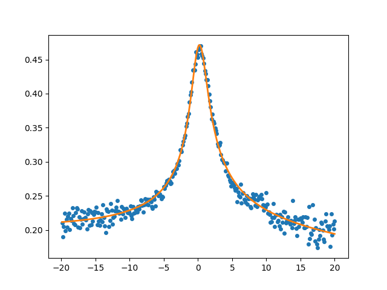

# HurwitzFanoFit -- Python program
Python program for fitting Hurwitz-Fano lineshapes to experimental data. 

## Installation
The Python program can be installed by simply downloading the Python script `hurwitzfit.py` from GitHub.
## System requirements
Python3 is required and the following Python packages:
* `numpy`
* `scipy`
* `matplotlib`

## Program usage

### Linux
The program can be run by typing in a linux shell:
```code
python hurwitzfit.py <fname> <col> <temp> [OPTIONS]
```
where the mandatory arguments are
* `<fname>`	: file name of text file containing data  
* `<col>`	: column number of measured $dI/dV$ data  
* `<temp>`	: temperature $T$ in Kelvin  

Optional arguments
* `--frota`			: Use Frota-Fano lineshape instead of Hurwitz-Fano.
* `--lock-in=Vrms`	: Take into account lock-in modulation. <Vrms> is the root-mean-square bias of the lock-in.
* `--show`			: Show the fit together with the data using matplotlib
* `--range=V1,V2`   : Bias range for fitting with data: V1<=V<=V2. If not specfied the entire data range will be used.

### Windows
Put here how to run the program in a Windows environment.

### MacOS
Put here how to run the program in a MacOS environment.

## Example
To fit the hurwitz lineshape to the example $dI/dV$ spectrum in `example.dat` for $T=2$K we type in the linux shell:
```code
python hurwitzfit.py example.dat 3 2.0 --show
```
Remark: the $dI/dV$ in `example.dat` is given in the third column.
The program output is:
```code

**************************************************************
***                                                        ***
***      hurwitzfit.py - fit to Hurwitz-Fano lineshape     ***
***                                                        ***
***  (c) 2023 by David Jacob, Universidad del Pais Vasco   ***
***                                                        ***
**************************************************************


*** Fitting Hurwitz-Fano lineshape to dI/dV data ***

 Data file:  example.dat
 dI/dV data in col # 3
 T =  2.0 K

 Number of data points:  400

*** Fit converged ***

 Elapsed time:  0.7936155796051025 s.

 Fit parameters:
 V0 =  0.17168125017870547
 A0 =  0.3344426146992541
 DeltaK =  1.1282716057883746
 phi =  0.0735022246256897
 a = -0.000584955470243615
 b = 0.14654382853439216

 GammaK =  2.868066421914048

 Writing temperature and all fit parameters to  optparams.dat
 Writing temperature and GammaK to  GammaK_vs_temp.dat
 Write fitted lineshape and dI/dV data to  hf_example.dat

Done.
```
This is the figure showing the fitted Hurwitz-Fano lineshape togehter with the data produced by the script (using the `--show` option ) with matplotlib:
<p align="center"></p>

