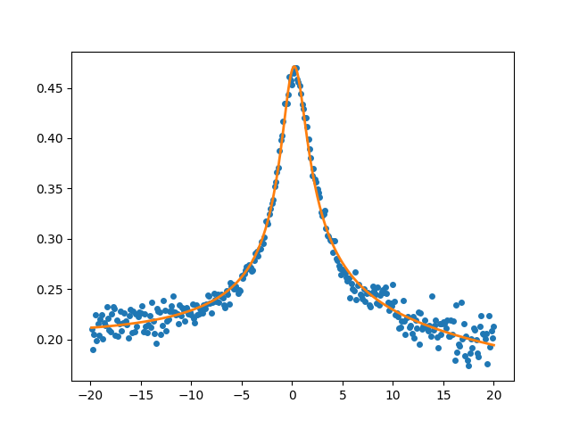

# HurwitzFanoFit
Python program for fitting Hurwitz-Fano lineshapes to experimental data. 

The Hurwitz-Fano lineshape describes a Kondo resonance in the differential conductance in the presence of Fermi-Dirac smearing at finite temperature of the STM tip [1].  

When the program is used for processing of data in a scientific publication, we ask the authors to acknowledge the use of the program and to cite Ref. 1 in that publication.

## Theoretical background
The python script can be used to fit different lineshapes that occur in the theory of STM spectroscopy (STS) of Kondo systems to STS data.

### Frota-Fano lineshape
First, the Frota lineshape yields an accurate description of the Kondo resonance in the spectral function of a Kondo system. 
Taking into account quantum interference by a Fano phase factor $\phi$, the Kondo resonance can be well described by the
following Frota-Fano lineshape [2]:
```math
A(\omega) = A_0 \, {\rm Re} \left[ e^{i\phi} \sqrt{\frac{i\Delta_{\rm K}}{\omega+i\Delta_{\rm K}}} \right] 
```
where $A_0$ is the amplitude of the Kondo resonance, $\phi\in[0,2\pi]$ is the Fano phase and $\Delta_{\rm K}$ is the Frota width parameter
which yields the halfwidth of the Kondo resonance as $\Gamma_{\rm K}=2.542\Delta_{\rm K}$.
When Fermi-Dirac smearing at the STM tip can be neglected ($T\rightarrow0$), the measured differential conductance ($dI/dV$) is directly proportional to $A(\omega$):
$\mathcal{G}(V) = dI/dV \propto A(eV)$.

### Hurwitz-Fano lineshape
Usually, smearing of the Fermi surface due to finite temperature $T$ at the STM tip cannot be neglected. 
In this case the lineshape of the Kondo resoance in the $dI/dV$ is given by a convolution with the derivative of the Fermi-Dirac distribution.
As we recently showed by us the resulting lineshape can be described in terms of a Hurwitz $\zeta$-function [1]:
```math
\mathcal{G}(V) = \frac{dI}{dV} \propto \int d\omega \, \left(-f^\prime(\omega)\right) \, A(\omega+eV) =
A_0 \, \sqrt{\frac{\beta \Delta_{\rm K}}{8\pi} } \,{\rm Re} \left[
    e^{i\phi} \zeta\left( \frac{3}{2}, \frac{\beta\Delta_{\rm K}}{2\pi} + \frac{1}{2} +i\frac{\beta eV}{2\pi} \right) 
\right]
```
where $\beta=1/kT$ the inverse temperature, $\Delta_{\rm K}$ is the Frota width parameter of the *underlying* Frota lineshape in the spectral function $A(\omega)$,
and $\phi$ the Fano phase factor describing quantum interference.
$\zeta(s,a)$ is the Hurwitz $\zeta$-function, a generalization of the Riemann $\zeta$-function,
defined by the infinite series [3]:
```math
\zeta(s,a) = \sum_{n=0}^{\infty} \frac{1}{(n+a)^s}
```
The Riemann $\zeta$-function is recovered for $a=1$. Note that the Python `scipy` and `mpmath` packages both provide implementations of the Hurwitz $\zeta$-function. However, the `scipy` implementation only allows for real arguments $s,a$, while we need $a$ to be complex. On the other hand, the `mpmath` implementation allows for complex arguments $s,a$, but is very slow, since `mpmath` makes use of arbitrary precision arithmetics. Therefore `hurwitzfit.py` has its own implementation of the Hurwitz $\zeta$-function based on the Euler-Maclaurin formula [4].

### Lock-in modulation
The effect of lock-modulation on the spectra in the STS experiment can be taken into account by an additional numerical convolution [5]:
```math
\tilde{\mathcal{G}}(V) = \int dV^\prime \, \chi_{\rm LI}(V^\prime) \, \mathcal{G}(V+V^\prime)
```
where $\mathcal{G}(V)$ is given either by the Frota-Fano or the Hurwitz-Fano lineshape, and the lock-in function $\chi_{\rm LI}$ is given by
```math
\chi_{\rm LI}(V) = \left\{ \begin{array}{cc} \frac{2\sqrt{2V_{\rm rms}^2 -V^2}}{\pi V_{\rm rms}^2} & \mbox{ for } |V|\le \sqrt2 V_{\rm rms} \\
 0 & \mbox{ for } |V| > \sqrt2 V_{\rm rms} \end{array} \right.
```

## Installation
The Python program can be installed by simply downloading the Python script `hurwitzfit.py` from GitHub.
## System requirements
Python3 is required and the following Python packages:
* `numpy`
* `scipy`
* `matplotlib`

## Program usage

### Linux
The program can be run by typing in a linux shell:
```code
python hurwitzfit.py <fname> <col> <temp> [OPTIONS]
```
where the mandatory arguments are
* `<fname>`	: file name of text file containing data  
* `<col>`	: column number of measured $dI/dV$ data  
* `<temp>`	: temperature $T$ in Kelvin  

Optional arguments
* `--frota`			: Use Frota-Fano lineshape instead of Hurwitz-Fano.
* `--lock-in=Vrms`	: Take into account lock-in modulation. <Vrms> is the root-mean-square bias of the lock-in.
* `--show`			: Show the fit together with the data using matplotlib
* `--range=V1,V2`   : Bias range for fitting with data: V1<=V<=V2. If not specfied the entire data range will be used.

### Windows
Put here how to run the program in a Windows environment.

### MacOS
Put here how to run the program in a MacOS environment.

## Example
To fit the hurwitz lineshape to the example $dI/dV$ spectrum in `example.dat` for $T=2$K we type in the linux shell:
```code
python hurwitzfit.py example.dat 3 2.0 --show
```
Remark: the $dI/dV$ in `example.dat` is given in the third column.
The program output is:
```code

**************************************************************
***                                                        ***
***      hurwitzfit.py - fit to Hurwitz-Fano lineshape     ***
***                                                        ***
***  (c) 2023 by David Jacob, Universidad del Pais Vasco   ***
***                                                        ***
**************************************************************


*** Fitting Hurwitz-Fano lineshape to dI/dV data ***

 Data file:  example.dat
 dI/dV data in col # 3
 T =  2.0 K

 Number of data points:  400

*** Fit converged ***

 Elapsed time:  0.7936155796051025 s.

 Fit parameters:
 V0 =  0.17168125017870547
 A0 =  0.3344426146992541
 DeltaK =  1.1282716057883746
 phi =  0.0735022246256897
 a = -0.000584955470243615
 b = 0.14654382853439216

 GammaK =  2.868066421914048

 Writing temperature and all fit parameters to  optparams.dat
 Writing temperature and GammaK to  GammaK_vs_temp.dat
 Write fitted lineshape and dI/dV data to  hf_example.dat

Done.
```
This is the figure showing the fitted Hurwitz-Fano lineshape togehter with the data produced by the script (using the `--show` option ) with matplotlib:
<p align="center"></p>

## References
[1] **Our paper**  
[2] H. O. Frota, Phys. Rev. B **45**, 1096 (1992); R. Zitko, Phys. Rev. B **84**, 195116 (2011)  
[3] See e.g. J. Sondow and E. W. Weisstein, "Hurwitz Zeta Function." From MathWorld--A Wolfram Web Resource. https://mathworld.wolfram.com/HurwitzZetaFunction.html  
[4] F. Johansson, Numerical Algorithms **69**, 253 (2015)  
[5] M Gruber, A. Weismann and R. Berndt, J. Phys.: Condens. Matter **30**, 424001 (2018)  
